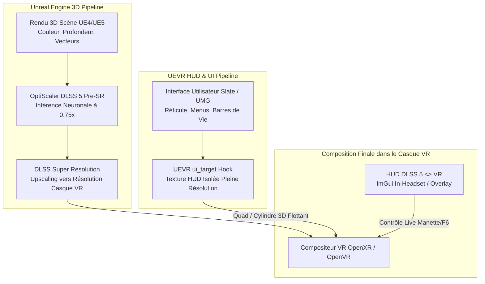

# Architecture Technique : DLSS 5 <> UEVR

Ce document détaille l'architecture complète, les mécanismes d'interception graphique, la gestion du HUD et la transposition du projet **VRDLSS5** (initialement conçu pour le framework LukeRoss R.E.A.L.) vers **UEVR (Praydog Universal Unreal Engine VR Mod)**.

---

## 1. Analyse Comparative : LukeRoss R.E.A.L. vs UEVR

| Domaine | LukeRoss R.E.A.L. VR Mod | Praydog UEVR |
| :--- | :--- | :--- |
| **Moteurs cibles** | Multi-moteurs propriétaires (REDengine, Snowdrop, Decima, Unreal, etc.) | **Unreal Engine 4 & 5 exclusivement** |
| **Méthode d'injection** | Proxy DLL statique (`dxgi.dll` ou `openvr_api.dll` dans le dossier de l'exécutable) | **Injection dynamique en mémoire** (`UEVRInjector.exe`) ou proxy DLL |
| **Pipeline Stéréoscopique** | Hooking externe des matrices de vue / rendu séquentiel ou alternatif (AER) | **Hooking natif de l'API Unreal Engine** (`IStereoRendering`, `FFakeStereoRenderingHook`, `FRenderTargetPool`) |
| **Runtimes VR** | OpenVR / OpenXR (avec incompatibilité overlay en OpenXR session) | **OpenXR natif** (Meta Quest Link, Virtual Desktop VDXR, Pico, Pimax) + **OpenVR** (SteamVR) |
| **Gestion du HUD en jeu** | Projection 3D ou plan 2D selon les profils de jeu | **Hooking Slate/UMG** (`FSlateRHIRenderer`, `ui_target`) projeté en quad ou cylindre 3D indépendant |
| **Intégration DLSS** | Interception NGX via `OptiScaler.asi` détecté nativement par `RealVR64.dll` | Interception NGX via plugin Unreal Engine DLSS (`nvngx_dlss.dll`, `sl.dlss.dll`) |

---

## 2. Le Pipeline Graphique Unreal Engine & DLSS 5 Pre-SR

### Problématique du Rendu VR Stéréoscopique
En VR, la résolution de rendu cible dépasse souvent **28 à 30 millions de pixels** par seconde (ex: 3120x3120 par œil à 72 ou 90 Hz).
- Un modèle de reconstruction neuronale appliqué en **Post-SR** (après upscaling) sur 30 Mpx requiert plus de **12 ms de temps d'inférence GPU**, provoquant un décrochage immédiat du framerate sous le seuil de rafraîchissement natif (reprojection forcée / ASW / saccades).
- En **Pre-SR Multipass** (`RunBeforeSR=true`, `WorkingScale=0.75`), le réseau neuronal DLSS 5 évalue la scène à une échelle intermédiaire réduite (avant l'upscaling Super Resolution).
  - La surface de calcul passe de 29.5 Mpx à **4.15 Mpx**.
  - Le coût d'inférence sur RTX 4090 / 5090 tombe à **~1.69 ms**, verrouillant un **72 / 90 FPS solide**.

### Préservation du HUD dans une Injection UEVR
Dans Unreal Engine, le rendu d'une frame s'organise chronologiquement :
1. **Rendu de la scène 3D** (G-Buffer, éclairage, ombres, réflexions) à la résolution de base.
2. **Post-traitement et Upscaling** :
   - DLSS 5 Pre-SR intervient sur les buffers de couleur et de profondeur non upscalés.
   - DLSS Super Resolution upscale l'image vers la résolution stéréoscopique finale de l'œil.
3. **Rendu de l'interface utilisateur (HUD Slate/UMG)** :
   - UEVR intercepte le renderer Slate (`on_pre_slate_draw_window` / `on_post_slate_draw_window`).
   - Le HUD (barres de vie, réticule, menus, carte) est rendu dans une texture dédiée isolée (`ui_target`) à pleine résolution native 1:1.
   - UEVR projette cette texture dans le monde virtuel sous forme de plan 3D (quad ou cylindre) devant le joueur.

> **Conséquence directe** : Le HUD n'est **jamais** flouté, déformé ni altéré par le réseau de neurones DLSS 5, car il est isolé de la passe 3D et composé ultérieurement avec une netteté vectorielle parfaite.



---

## 3. Architecture à Double Intégration

Pour offrir une compatibilité à 100% avec tous les casques et tous les modes d'injection UEVR, le projet propose deux composants complémentaires :

### A. Le Plugin Natif UEVR (`VRDLSS5_UEVR_Plugin.dll`)
- **Emplacement** : `<Jeu>\Binaries\Win64\uevr\plugins\VRDLSS5_UEVR_Plugin.dll`
- **Mécanisme** :
  - Chargé automatiquement par le `PluginLoader` de UEVR lors de l'injection.
  - Implémente l'API C++ officielle de UEVR (`uevr::Plugin`).
  - S'abonne aux callbacks :
    - `on_post_render_vr_framework_dx12` & `dx11` : Rendu du HUD interactif en réalité virtuelle via ImGui.
    - `on_xinput_get_state` : Détection du combo `Select + L3` et isolation des touches directionnelles (D-Pad).
    - `on_message` : Raccourcis clavier (`F6` toggle, `F8` ResidualAcrossRR, `Escape` fermeture).
- **Avantage majeur** :
  - Fonctionne de manière **100% native sous OpenXR** (Meta Quest Link, Virtual Desktop VDXR, Pico, Pimax OpenXR) sans passer par SteamVR, éliminant tout risque de conflit `XR_ERROR_CALL_ORDER_INVALID`.

### B. Le Dual-Proxy Standalone (`dxgi.dll`)
- **Emplacement** : `<Jeu>\Binaries\Win64\dxgi.dll`
- **Mécanisme** :
  - Intercepte les 24 exports DXGI système (`CreateDXGIFactory`, `CreateDXGIFactory1`, etc.).
  - Charge `OptiScaler.dll` et intercepte les points d'entrée NGX (`NVSDK_NGX_D3D12_EvaluateFeature`).
  - Déploie un overlay OpenVR natif (style fpsVR) pour les utilisateurs de SteamVR, doublé d'un OSD transparent Win32 sur le bureau.
  - Masque les entrées manette via MinHook inline sur `XInputGetState` et `joyGetPosEx`.

---

## 4. Canal de Contrôle Temps Réel (Shared Memory IPC)

OptiScaler ne relit `OptiScaler.ini` qu'au démarrage du jeu. Pour permettre un réglage **instantané** en cours de partie dans le casque VR, le HUD publie ses modifications dans un bloc de mémoire partagée :

```cpp
#define VRDLSS5_CTL_MAGIC 0x354C4456u // 'VDL5'
#define VRDLSS5_CTL_VERSION 3u
#define VRDLSS5_CTL_MAPPING_NAME "Local\\VRDLSS5_Control_1"

struct VrDlss5ControlBlock {
    unsigned int magic;
    unsigned int version;
    volatile LONG seq;
    volatile LONG ackSeq;
    volatile LONG optiReady;
    volatile LONG enabled;
    float workingScale;
    volatile LONG runBeforeSR;
    volatile LONG residualAcrossRR;
    volatile LONG preset;
    float intensity;
    volatile LONG style;
    volatile LONG featureRunning;
    float gpuFrameMs;
    float localStructure;
    float localTone;
    volatile LONG autoMask;
    float skinStructure;
    float transferStrength;
    float colourStrength;
    volatile LONG passes;
    volatile LONG reserved[8];
};
```

- **Nommage par PID** : `Local\VRDLSS5_Control_1_<pid>` pour éviter toute interférence si plusieurs instances tournent simultanément.
- **Debounce de 500 ms** : Les modifications appliquées en direct sont consolidées sur le disque dans `OptiScaler.ini` uniquement après 500 ms d'inactivité, éliminant tout micro-stutter lié aux entrées/sorties disque.

---

## 5. Dynamic VR Frame Guard

Le système intègre un moniteur continu de télémétrie de trame :
- Il mesure le temps de rendu GPU réel (`gpuFrameMs`).
- Si le budget de trame (ex: 13.88 ms pour 72 Hz, 11.11 ms pour 90 Hz) est menacé de façon soutenue pendant plus de 1.5 seconde :
  - Le Frame Guard réduit automatiquement le `WorkingScale` d'un cran (ex: de 0.75x à 0.66x, ou de 0.66x à 0.50x).
  - La valeur est injectée immédiatement dans OptiScaler.
  - Cela évite le décrochage soudain vers la reprojection synchrone (ASW à 36/45 FPS) et préserve un confort visuel optimal sans nausée.
